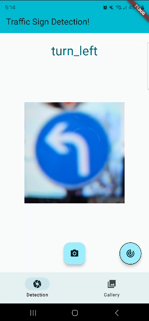
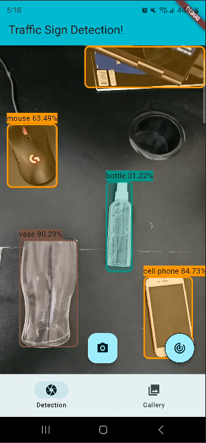
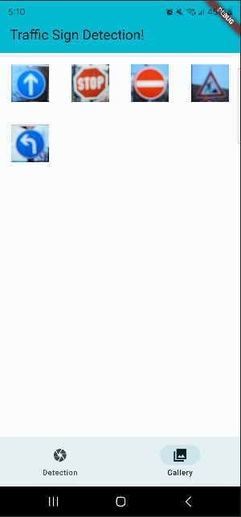
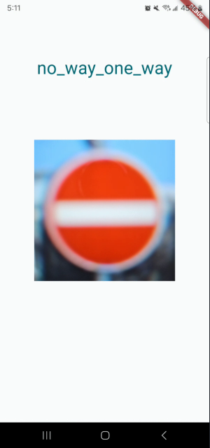
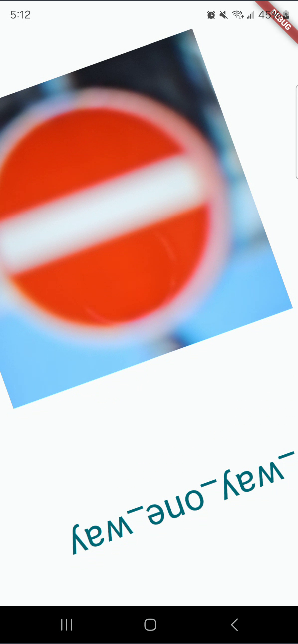
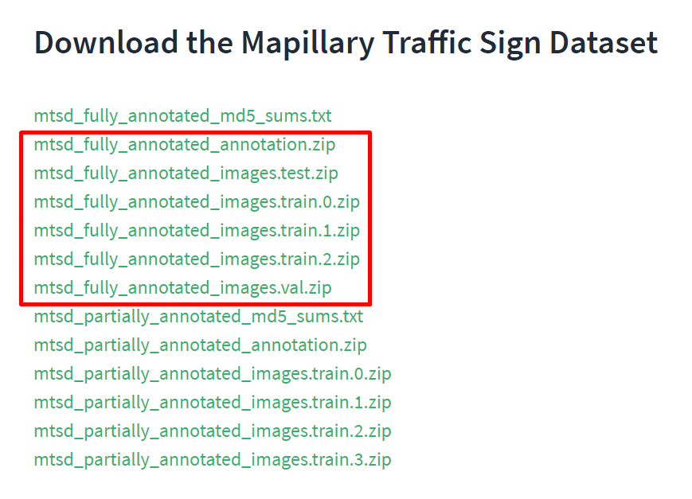
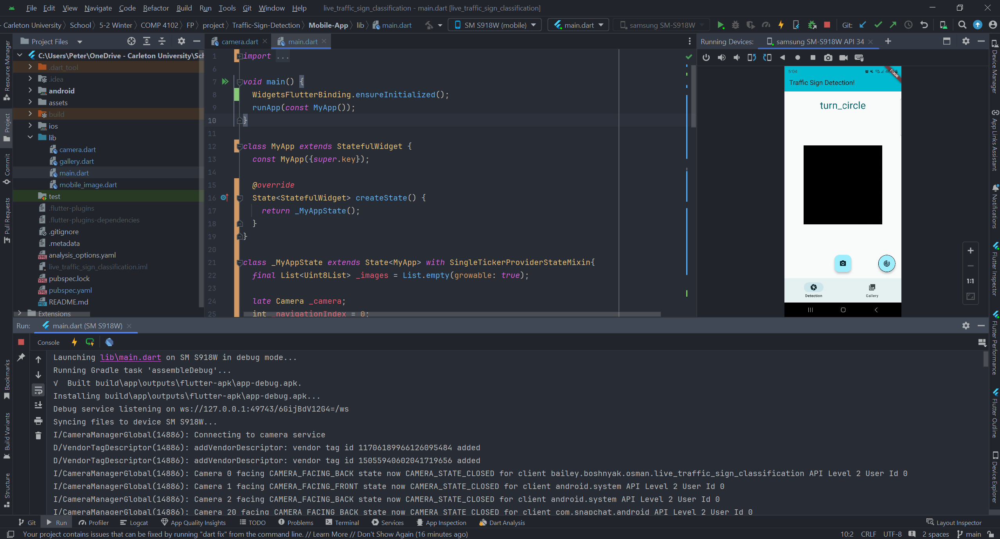

# Group 99: Traffic-Sign-Detection
Traffic sign recognition and localization.  
- Peter Bailey 101157705  
- Hamza Osman 123123123  
- Vadim Boshnyak 123123123  

## Overview
There are a few key components to the project
1. Our custom AlexNet traffic sign categorization neural network
2. The YOLOv5 training neural network
3. The Flutter mobile app

# How To Run

## GTSRB Classification Sample Script

## Android Application
Requires either
- A) An Android phone which can install [the app APK](https://drive.google.com/file/d/1MHEOfz43j-FumzRXSGm3AV8wUzSVJSUp/view?usp=sharing)
  1. Download the APK
  2. Install it
  3. Open the application (the prediction models are already included)

- B) An emulated Android phone (Can be obtained through android studio go to Device Manager then click "Create device")
  - In this case, follow the build steps decribed in [the section below](#building-android-app)
  - This is not ideal as the purpose is to use the device camera

### How to Use
There are a few pieces to the app
### Detection Screen
* You will see a camera preview, this is the image stream on which the categorization/detection occurs
* The camera button on the bottom center takes a snapshot of the image + label(s) which are viewable in the gallery
* the circular button on the bottom right changes between categorization and identification mode
* Prediction happens automatically, the label will appear on the top for categorization or will display a bounding box for localization

 

### Gallery Screen
* Clicking Gallery on the bottom navigator will show you the snapshots you have taken thus far
* You can tap on one to view it
* This image is mobile, feel free to scale, translate, and rotate it as you like!
* Hit your phone's back button / gesture to return to the gallery

  

# Everything Below is Training and Building

## Training YOLOv5
1. download the mapillary training and validation datasets from https://www.mapillary.com/dataset/trafficsign  

2. Unzip the files and create the following directory structure:  
```main_directory/  
│  
├── train/  
│   ├── images/  
│       └── [series_of_jpgs]  
│  
├── validate/  
│   ├── images/  
│       └── [series_of_jpgs]  
│  
└── mtsd_v2_fully_annotated/  
    ├── annotations/  
    │   └── [series_of_jsons]  
    └── splits/  
        ├── train.txt  
        ├── test.txt  
        └── val.txt  
```
3. Using the following command to get the data in a structure for YOLO training  
`python /path/to/preprocessing.py initialize --input-location /location/of/data/created/in/step_2 --output-location /where/to/store/processed/data/for/YOLOv5`

4. Now install yolo in `/where/to/store/processed/data/for/YOLOv5/"data"` (note that there is a data directory now)  
```
git clone https://github.com/ultralytics/yolov5  # clone
cd yolov5
pip install -r requirements.txt  # install
```

6. Now from within the same directory (`/where/to/store/processed/data/for/YOLOv5/"data"`) run YOLOv5 with  
From within your --output-location run the following command  
`python yolov5/train.py --img 640 --batch 16 --epochs 3 --data dataset.yaml --weights '' --cfg yolov5n.yaml`

Note that the yaml file can be 5n, 5s, 5m and so on.

7. Now generate the torchscript file  
`python yolov5/export.py --weights yolov5/runs/train/expXYZ/weights/best.pt --include torchscript --img 640 --optimize`

## Training GTSRB

TODO THE READMEN PORTION

## Building Android App
The android app allows for detection and classification in real time while also providing the ability to take snapshots and view them.

### Requirements
- Android studio
- An Android phone with developer settings and USB debugging enabled

### Building and Running Project
1. Install android studio: https://developer.android.com/studio/install
2. Install flutter: https://docs.flutter.dev/get-started/editor?tab=androidstudio
3. Open the project
4. Plug developer enabled Android phone into PC
5. Main can be found in the `lib` directory
6. Hit the green arrow from main or the top right
7. Your editor should now look like so:


